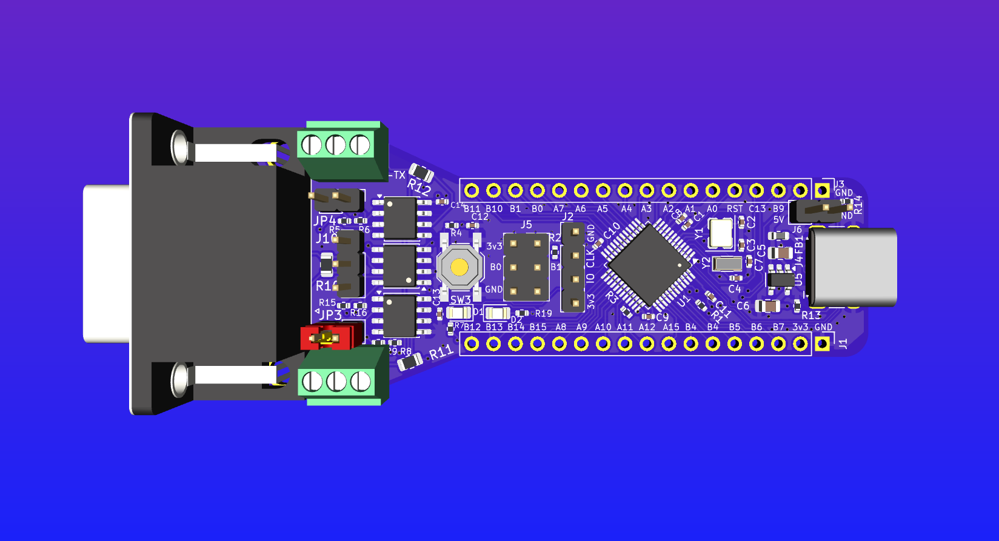

# FalCAN Probe

A compact USB 2.0 to CAN/RS‑485/RS‑422 hardware probe for interfacing and debugging CAN networks and differential serial buses. Designed in KiCad 9.
Firmware is here: <https://github.com/AndersBNielsen/FalCAN_fw>

## Can I buy one?
You can buy a FalCAN here: https://www.imania.dk/index.php?cPath=204&sort=5a&language=en

## Video overview
https://youtu.be/pHMQbOrLfP4

## Blog post
https://abnielsen.com/falcan

## Overview
- MCU: STM32F042C6Tx (USB FS device)
- CAN transceiver: SN65HVD230
- RS‑485/RS‑422 transceivers: SP3485EN (2x)
- USB‑C receptacle (HCTL HC‑TYPE‑C‑16P‑01A)
- 3.3V LDO regulator: MIC5504‑3.3
- Crystals: 8 MHz and 32.768 kHz
- CAN DE‑9 (female) connector for classic CAN pinout
- Jumpers/headers for boot, CAN, RS‑422/485 routing

Project metadata
- Title: FalCAN Probe
- Company: ABNielsen.com
- Revision: 0
- Board: 4‑layer FR4, ~1.6 mm 

## Repository Structure
- `USB-FalCAN.kicad_sch` — KiCad schematic
- `USB-FalCAN.kicad_pcb` — KiCad PCB layout
- `USB-FalCAN.kicad_pro` — KiCad project file
- `USB-FalCAN.kicad_prl` — KiCad project local settings
- `DSUB-9_... .kicad_mod` — Custom footprint for DE‑9 female connector
- `production/` — Fabrication outputs
  - `bom.csv` — Bill of Materials (includes LCSC part numbers)
  - `designators.csv` — Designator map
  - `positions.csv` — Pick‑and‑place (component positions)
  - `netlist.ipc` — IPC‑D‑356 netlist
  - `backups/` — Historical fabrication snapshots
- `fabrication-toolkit-options.json` — Fabrication/export options

## Key BOM Highlights
From `production/bom.csv`:
- MCU: STM32F042C6Tx (LQFP‑48)
- CAN: SN65HVD230 (SOIC‑8)
- RS‑485/422: SP3485EN (SOIC‑8, 2x)
- USB‑C receptacle: HC‑TYPE‑C‑16P‑01A
- LDO: MIC5504‑3.3
- Crystals: 8 MHz (3225), 32.768 kHz (3215)
- LEDs: Green (D1), Red (D2)
- DE‑9 CAN connector and various pin headers/jumpers

## Fabrication
- KiCad: generator version 9.0; board setup targets a 4‑layer FR4 stackup.
- Use KiCad’s Plot tool to generate Gerbers and drill files (settings are stored in the project). The IPC netlist in `production/netlist.ipc` can be provided to your manufacturer for electrical test.
- Pick‑and‑place: `production/positions.csv`.
- BOM: `production/bom.csv` contains LCSC part numbers to streamline sourcing; DNPs are excluded per `fabrication-toolkit-options.json`.

## Assembly & Bring‑Up
- Power from USB‑C (`VBUS`) with on‑board 3.3 V regulation.
- Boot/Programming: STM32F042 can be programmed via USB DFU or SWD (boot header present). Firmware will be released separately.
- CAN I/O: DE‑9 (male) with `CAN_H` and `CAN_L`; USB‑C provides data connection to host.
- RS‑485/RS‑422: Routing and driver enable/receive enable pins exposed via headers/jumpers.

If JP4 is closed at reset, USB is CDC USART1 for RS422/485.
If JP4 in open, USB is GS_USB CAN

Jumpers can be moved into any position after reset. 

RS-422: Default
Full duplex RS-422: Short JP3 & JP4

RS422/485 can be used in CAN mode using external USB-to-UART via USART1 pins (PB7 is RX and PB6 is TX)

## Status
Hardware files are provided; software/firmware will be licensed and released later.

## License
Hardware design files in this repository are licensed under the Creative Commons Attribution‑ShareAlike 4.0 International (CC BY‑SA 4.0). See `LICENSE-Hardware.md` for the full text.

Software/firmware (when added) will use a separate license.

## Credits
- Author/Company: ABNielsen.com
- EDA: KiCad 9

## Getting a PCB
This project is kindly sponsored by JLCPCB. They offer cheap, professional looking PCBs and super fast delivery.

Step 1: Get the gerber file zip package from the /hardware folder

Step 2: Upload to JLCPCB [https://jlcpcb.com/?from=Anders_N](https://jlcpcb.com/?from=Anders_N)

Step 3: Pick your color, surface finish and order.

You can use these affiliate links to get a board for $2 and also get $123 worth of New User Coupons at: https://jlcpcb.com/?from=Anders_N

And in case you also want to order a 3D-printed case you can use this link. 
How to Get a $7 3D Printing Coupon: [https://3d.jlcpcb.com/?from=Anders3DP](https://jlc3dp.com/?from=Anders_N)
